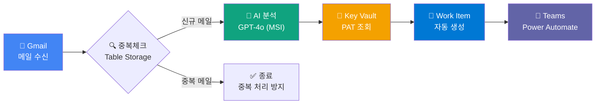

# 📧 Email2ADO - Gmail 기반 이메일 자동화 시스템

> **한 줄 요약**: Gmail 메일 수신 → AI 분석(GPT-4o) → Azure DevOps Work Item 자동 생성 → Teams 알림

**버전**: v2.4.0 | **최종 업데이트**: 2026-01-31 | **담당자**: 김영대 (azure-mvp@zerobig.kr) | **상태**: ✅ 운영 중

---

## 📖 문서 읽는 순서

| 순서 | 문서 | 목적 | 소요시간 |
|------|------|------|----------|
| 1️⃣ | **README.md** (현재) | 전체 이해 + 빠른 시작 | 5분 |
| 2️⃣ | [docs/ARCHITECTURE.md](docs/ARCHITECTURE.md) | 상세 아키텍처 설계 | 15분 |
| 3️⃣ | [docs/DEPLOY.md](docs/DEPLOY.md) | 🆕 **Azure 배포 가이드** | 20분 |
| 4️⃣ | [docs/GMAIL-SETUP.md](docs/GMAIL-SETUP.md) | Gmail OAuth 연결 설정 | 10분 |
| 5️⃣ | [docs/GMAIL-INTEGRATION.md](docs/GMAIL-INTEGRATION.md) | 🆕 **Gmail 자동 연동 가이드** | 15분 |
| 6️⃣ | [docs/LOCAL-TESTING.md](docs/LOCAL-TESTING.md) | 로컸 개발 환경 설정 | 10분 |
| 📌 | [docs/TROUBLESHOOTING.md](docs/TROUBLESHOOTING.md) | 🆕 **문제 해결 가이드** | 필요시 |
| 📌 | [docs/GMAIL-FIELD-MAPPING.md](docs/GMAIL-FIELD-MAPPING.md) | Gmail 필드 매핑 참조 | 필요시 |
| 📌 | [docs/CHANGELOG.md](docs/CHANGELOG.md) | 변경 이력 | 필요시 |

---

## 🎯 시스템 개요



### 핵심 기능
| 기능 | 설명 | 기술 |
|------|------|------|
| 📧 **이메일 트리거** | Gmail 새 메일 감지 (HTTP Trigger) | Logic App Standard |
| 🔍 **중복 방지** | Message ID 기반 중복 체크 | Azure Table Storage + MSI |
| 🤖 **AI 분석** | 이메일 요약, 인사이트, 액션 아이템 추출 | Azure OpenAI GPT-4o + MSI |
| 📝 **Work Item 생성** | Issue 자동 생성 | Azure DevOps REST API + Key Vault PAT |
| 💬 **Teams 알림** | 채널 알림 (Adaptive Card) | Power Automate Workflow |

---

## 📁 프로젝트 구조

```
Email2ADO/
├── 📁 docs/                        # 📚 문서
│   ├── ARCHITECTURE.md             # 아키텍처 설계 (WAF 기반)
│   ├── DEPLOY.md                   # 🆕 Azure 배포 가이드
│   ├── GMAIL-SETUP.md              # Gmail OAuth 설정
│   ├── LOCAL-TESTING.md            # 로컬 개발 환경
│   ├── TROUBLESHOOTING.md          # 🆕 문제 해결 가이드
│   ├── GMAIL-FIELD-MAPPING.md      # Gmail 필드 매핑
│   └── CHANGELOG.md                # 변경 이력
│
├── 📁 src/                         # 소스 코드
│   └── Email2ADO-Workflow/         # Logic App Standard 워크플로우
│       ├── Email2ADO-HTTP/         # ✅ HTTP Trigger 워크플로우 (운영)
│       │   └── workflow.json       # 핵심 워크플로우 정의
│       ├── Email2ADO-Gmail/        # ⚠️ Gmail Trigger (V1 제한)
│       │   └── workflow.json       
│       ├── connections.json        # API Connection 설정
│       ├── host.json               # 런타임 설정
│       └── local.settings.template.json  # 환경 변수 템플릿
│
├── 📁 infra/                       # Infrastructure as Code
│   ├── main.bicep                  # 메인 배포 파일
│   ├── modules/                    # Bicep 모듈
│   │   ├── storage.bicep           # Storage Account
│   │   ├── logic-app.bicep         # Logic App Standard
│   │   ├── key-vault.bicep         # Key Vault
│   │   └── api-connections.bicep   # API Connections
│   └── parameters/                 # 환경별 파라미터
│       └── zbtaskman.bicepparam    # prod 환경
│
├─ 📁 scripts/                     # 🆕 Gmail 연동 스크립트
│   └─ gmail-trigger.gs            # Google Apps Script (Gmail → HTTP)
│
├── 📁 tests/                       # 테스트
│
├── 📁 .github/                     # GitHub/Copilot 설정
│   └── copilot-instructions.md     # Copilot 운영 규칙
│
└── README.md                       # 현재 문서
```

---

## ☁️ Azure 리소스

### 리소스 목록

| 리소스 유형 | 이름 | 용도 | 인증 방식 |
|------------|------|------|----------|
| Resource Group | `rg-zb-taskman` | 리소스 그룹 | - |
| Logic App Standard | `email2ado-logic-prod` | 워크플로우 실행 | **MSI** |
| Storage Account | `stemail2adoprodxhum3jlfa` | Table Storage (중복 방지) | **MSI** |
| Azure OpenAI | `zb-taskman` | GPT-4o AI 분석 | **MSI** |
| Key Vault | `kv-zbtask-prod` | ADO PAT 보안 저장 | **MSI** |
| App Registration | `Email2ADO-HTTP-Auth` | Easy Auth 인증 | Entra ID |
| API Connection | `gmail-prod` | Gmail 연결 | OAuth 2.0 |
| API Connection | `teams-prod` | Teams 연결 | OAuth 2.0 |
| API Connection | `visualstudioteamservices-prod` | ADO 연결 | OAuth 2.0 |

### RBAC 역할 할당

| Principal | Role | Scope |
|-----------|------|-------|
| email2ado-logic-prod (MSI) | Storage Table Data Contributor | Storage Account |
| email2ado-logic-prod (MSI) | Cognitive Services OpenAI User | Azure OpenAI |
| email2ado-logic-prod (MSI) | Key Vault Secrets User | Key Vault |

---

## 🚀 빠른 시작

### 사전 요구사항

```powershell
# 필수 도구 버전 확인
az --version          # Azure CLI 2.50+
func --version        # Azure Functions Core Tools 4.x

# Azure 로그인
az login
az account set --subscription "YOUR_SUBSCRIPTION_ID"
```

### 신규 환경 배포 (전체)

```powershell
# 1. 저장소 클론
git clone https://dev.azure.com/azure-mvp/ZBTaskManager/_git/ZBTaskManager
cd ZBTaskManager

# 2. Bicep 배포 (전체 인프라)
cd infra
az deployment group create `
  --resource-group rg-zb-taskman `
  --template-file main.bicep `
  --parameters parameters/zbtaskman.bicepparam

# 3. Key Vault에 ADO PAT 저장
az keyvault secret set `
  --vault-name kv-zbtask-prod `
  --name ado-pat `
  --value "YOUR_ADO_PAT_HERE"

# 4. API Connection OAuth 인증 (Azure Portal에서)
# - gmail-prod: Gmail 계정 인증
# - teams-prod: Teams 계정 인증
# - visualstudioteamservices-prod: ADO 계정 인증

# 5. 워크플로우 배포
cd ../src/Email2ADO-Workflow
Compress-Archive -Path "./*" -DestinationPath "./deploy.zip" -Force
az functionapp deployment source config-zip `
  --name email2ado-logic-prod `
  --resource-group rg-zb-taskman `
  --src "./deploy.zip"

# 6. 워크플로우 상태 확인
az rest --method GET `
  --uri "https://management.azure.com/subscriptions/{subId}/resourceGroups/rg-zb-taskman/providers/Microsoft.Web/sites/email2ado-logic-prod/workflows?api-version=2023-01-01"
```

### 로컬 개발 환경

```powershell
# 1. 환경 설정 파일 생성
cd src/Email2ADO-Workflow
cp local.settings.template.json local.settings.json

# 2. local.settings.json 편집 (값 채우기)
# - AZURE_OPENAI_ENDPOINT
# - ADO_PAT (로컬 테스트용)
# - STORAGE_ACCOUNT_NAME

# 3. 로컬 실행
func start
```

---

## 🔐 보안 아키텍처

### 인증 방식

```
┌─────────────────────────────────────────────────────────────────────┐
│                         보안 아키텍처 (v2.3.0)                        │
├─────────────────────────────────────────────────────────────────────┤
│                                                                      │
│   [외부 호출자] ──Easy Auth──▶ [Logic App HTTP Trigger]            │
│                   (Entra ID)                                         │
│                                                                      │
│   [Logic App MSI] ──RBAC──▶ [Table Storage]                         │
│                              (Storage Table Data Contributor)        │
│                                                                      │
│   [Logic App MSI] ──RBAC──▶ [Azure OpenAI]                          │
│                              (Cognitive Services OpenAI User)        │
│                                                                      │
│   [Logic App MSI] ──RBAC──▶ [Key Vault] ──▶ [ADO PAT]              │
│                              (Key Vault Secrets User)                │
│                                                                      │
│   [OAuth Token] ──API Connection──▶ [Gmail/Teams/ADO]               │
│                                                                      │
└─────────────────────────────────────────────────────────────────────┘
```

### 민감 정보 관리

| 항목 | 저장 위치 | 접근 방식 |
|------|----------|----------|
| ADO PAT | Key Vault (ado-pat) | MSI 런타임 조회 |
| Gmail OAuth | API Connection | 자동 토큰 갱신 |
| Teams OAuth | API Connection | 자동 토큰 갱신 |
| OpenAI 인증 | MSI | API Key 불필요 |

---

## ⚠️ 알려진 제한 사항

| 제한 | 원인 | 해결책 |
|------|------|--------|
| Gmail 트리거 Unhealthy | V1 커넥터 `connectionRuntimeUrl` 미지원 | HTTP Trigger 방식 사용 |
| Teams Graph API 불가 | `ChannelMessage.Send` Application 권한 없음 | Power Automate Workflow |
| Incoming Webhook 지원 중단 | Microsoft 2025.12 종료 예정 | Power Automate Workflow |

---

## 📋 Phase 진행 현황

| Phase | 내용 | 상태 | ADO Work Item |
|-------|------|------|---------------|
| Phase 0 | 프로젝트 초기화 및 계획 | ✅ Done | #205 |
| Phase 1 | Infrastructure as Code (Bicep) | ✅ Done | #206 |
| Phase 2 | Gmail 트리거 구성 | ✅ Done | #207 |
| Phase 3 | 핵심 기능 구현 | ✅ Done | #208 |
| Phase 4 | Azure OpenAI 통합 | ✅ Done | #209 |
| Phase 5 | Azure E2E 테스트 | ✅ Done | #210 |
| Phase 6 | 문서화 및 완료 | ✅ Done | #211 |
| Phase 7 | Key Vault 보안 강화 | ✅ Done | #213 |
| Phase 8 | V1 커넥터 제한 우회 | ✅ Done | #216 |
| Phase 9 | Azure WAF 보안 강화 | ✅ Done | #218 |
| Phase 10 | 프로젝트 문서 현행화 | ✅ Done | #219 |
| **Phase 11** | **Gmail 자동 연동 구성** | ✅ Done | #221 |

---

## 🔗 관련 링크

| 링크 | URL |
|------|-----|
| ADO 프로젝트 | https://dev.azure.com/azure-mvp/ZBTaskManager |
| Work Items | https://dev.azure.com/azure-mvp/ZBTaskManager/_workitems |
| Git 저장소 | https://dev.azure.com/azure-mvp/ZBTaskManager/_git/ZBTaskManager |
| Epic | https://dev.azure.com/azure-mvp/ZBTaskManager/_workitems/edit/204 |

---

## 📚 참고 문서

- [Azure Well-Architected Framework](https://learn.microsoft.com/en-us/azure/well-architected/)
- [Logic Apps Standard 보안](https://learn.microsoft.com/en-us/azure/logic-apps/logic-apps-securing-a-logic-app)
- [Key Vault MSI 인증](https://learn.microsoft.com/en-us/azure/logic-apps/authenticate-with-managed-identity)
- [Easy Auth](https://learn.microsoft.com/en-us/azure/app-service/overview-authentication-authorization)

---

## 📝 변경 이력 요약

| 버전 | 날짜 | 변경 내용 |
|------|------|----------|
| **v2.4.0** | 2026-01-31 | Gmail 자동 연동 (Google Apps Script), 문서 현행화 |
| v2.3.0 | 2026-01-30 | Azure WAF 보안 강화 (Key Vault 런타임, Easy Auth) |
| v2.2.0 | 2026-01-30 | Phase 8 - V1 커넥터 우회, E2E 테스트 완료 |
| v2.1.0 | 2026-01-30 | Key Vault 통합 (ADO PAT 보안 저장) |
| v2.0.0 | 2026-01-30 | Gmail 트리거 전환, rg-zb-taskman 배포 |
| v1.0.0 | 2026-01-24 | Office 365 기반 초기 버전 |

상세 내용은 [docs/CHANGELOG.md](docs/CHANGELOG.md) 참조
